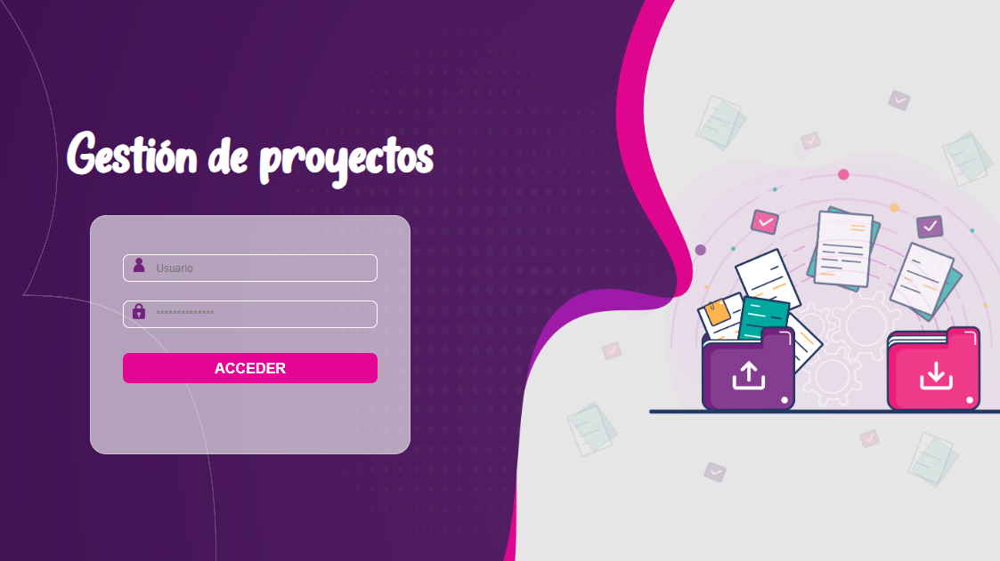
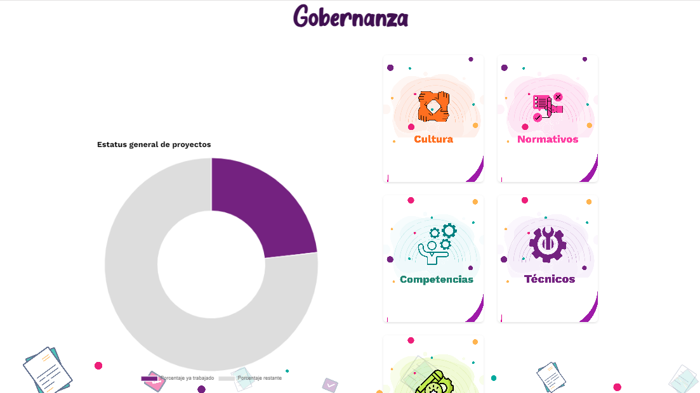
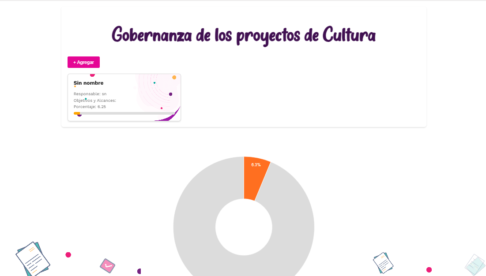

# Proyecto de Gobernanza de Proyectos

Este proyecto tiene como objetivo gestionar y monitorear el progreso de los diferentes proyectos de **Gobernanza**. La aplicación web permite a los usuarios visualizar, editar y agregar información sobre los proyectos relacionados con la gobernanza cultural. Además, incluye herramientas para analizar el progreso de los proyectos mediante gráficas y una interfaz sencilla de interacción.

## Funcionalidades principales

- **Visualización de Proyectos**: Los proyectos se muestran en forma de tarjetas que incluyen el nombre del proyecto, el responsable, los objetivos y el porcentaje de progreso.
- **Gestión de Proyectos**: Permite agregar, modificar o eliminar información de los proyectos existentes mediante un modal de edición. Cada proyecto tiene varios campos clave como nombre, responsable, desarrollo interno o externo, logística, implementación, monitoreo, y más.
- **Gráfica de Progreso**: Una gráfica en forma de dona muestra el porcentaje global de progreso de los proyectos.
- **Barra de Progreso Individual**: Cada proyecto incluye una barra que muestra el porcentaje de avance específico.
- **Datos dinámicos**: Los datos de los proyectos están enlazados con Google Sheets para actualizarse y reflejar cambios en tiempo real.

## Estructura del Proyecto

El proyecto se compone de los siguientes archivos principales:

### 1. **HTML**
- **`cultura.html`**: La interfaz principal donde los usuarios pueden ver los proyectos en formato de tarjetas. Incluye un modal para agregar y editar proyectos, y gráficos que muestran el progreso.

### 2. **Google Apps Script**
- **`cultura.gs`**: Contiene las funciones de backend que interactúan con Google Sheets. Gestiona la obtención, actualización, eliminación y adición de datos de los proyectos en la hoja de cálculo de "Gobernanza - Cultura".

### 3. **Hoja de Cálculo de Google Sheets**
- **Google Sheets** es la base de datos donde se almacenan todos los proyectos. Los scripts de Apps Script están vinculados a esta hoja para leer y escribir datos en tiempo real.

## Componentes Clave

### Tarjetas de Proyectos
Cada tarjeta de proyecto muestra la siguiente información:
- **Nombre del proyecto**
- **Responsable**
- **Objetivos y Alcances**
- **Porcentaje de avance**

### Modal de Edición
Este modal permite a los usuarios agregar o editar la información de los proyectos. Los campos incluyen:
- Nombre del proyecto
- Desarrollo (interno o externo)
- Responsable
- Objetivos y Alcances
- Logística (fechas, participantes, invitaciones, etc.)
- Monitoreo (encuestas de satisfacción, evaluación de conocimientos)
- Cierre del proyecto (reporte final, comprobantes de pago)
- Porcentaje de avance

### Gráficas
1. **Gráfica de Progreso Global**: Un gráfico de dona que muestra el porcentaje total de avance de todos los proyectos en conjunto.
2. **Barras de Progreso por Proyecto**: Cada tarjeta de proyecto tiene una barra que muestra visualmente el porcentaje de avance individual.

## Cómo funciona

1. **Interacción con Google Sheets**: El proyecto usa Google Apps Script para conectarse con Google Sheets, donde se almacena toda la información relacionada con los proyectos.
2. **Carga Dinámica**: Al cargar la página, se obtienen los datos de los proyectos desde Google Sheets y se muestran en tarjetas dinámicas.
3. **Edición y Actualización**: Cuando un usuario modifica un proyecto, los cambios se envían de nuevo a Google Sheets para actualizar la información.
4. **Visualización del Progreso**: Las gráficas y las barras de progreso se actualizan automáticamente basándose en los datos actuales de cada proyecto.

## Requisitos

- **Google Sheets**: Se debe contar con una hoja de cálculo donde se almacenan los proyectos.
- **Google Apps Script**: Se utiliza para manejar el backend y la lógica del servidor.
- **Google Charts**: Para generar las gráficas de progreso visuales.

## Cómo empezar

1. **Configura Google Sheets**: Crea una hoja de cálculo con la estructura de datos especificada en los scripts (ID, nombre del proyecto, responsable, etc.).
2. **Vincula Apps Script**: Usa los scripts `cultura.gs` para conectarte a la hoja de cálculo de Google.
3. **Carga la Interfaz**: Usa el archivo `cultura.html` para visualizar la interfaz de usuario.

## Autor

Este proyecto ha sido desarrollado para mejorar la gestión y monitoreo de los proyectos de Gobernanza. Si tienes alguna duda o necesitas más información, no dudes en ponerte en contacto.

